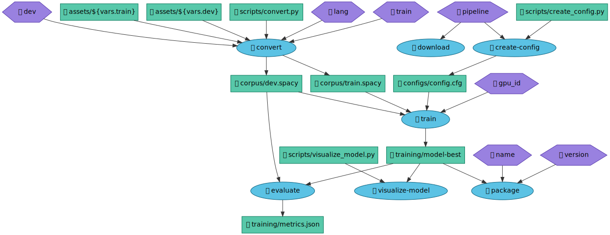

# spaCy Project Viz

[](https://codecov.io/gh/pmbaumgartner/spacy-project-viz)

CLI Tool to help generate a mermaid.js or graphviz chart of commands, dependencies, outputs, and optionally variables from a spaCy project.yml file.

**Example**

```bash
spacy-project-viz example/project.yml --vars -f graphviz-svg > example/graphviz.svg
```



For more, see the `examples` folder.

## Installation

Only from github for now:

```
pip install 'git+https://github.com/pmbaumgartner/spacy-project-viz.git#egg=spacy-project-viz'
```

To use `graphviz`, you will need to install an extra. This is intentional since graphviz will have to be [installed](https://www.graphviz.org/download/) on your system outside of pip. The `mermaid` commands work without the `graphviz` extra. However, the layout options aren't as good with `mermaid`.

To install with the `graphviz` extra:

```
pip install 'git+https://github.com/pmbaumgartner/spacy-project-viz.git#egg=spacy-project-viz[graphviz]'
```

## Usage

The only required argument is the path to a spaCy `project.yml` file. By default, it will return a mermaid.js graph definition to stdout.

To see all options and output formats, run `spacy-project-viz --help`, you'll see:

```
Usage: spacy-project-viz [OPTIONS] PROJECT_YAML

  Generate a mermaid.js or graphviz chart of commands, dependencies,
  outputs, and optionally variables from a spaCy project.yml file.

  Output goes to STDOUT.

  For the default format (mermaid-definition), you can copy the graph
  definition and paste it at https://mermaid-js.github.io/mermaid-live-
  editor/

  For the graphviz-definition, you can copy the graph definition and paste
  it at https://dreampuf.github.io/GraphvizOnline/, or use the graphviz-url
  format.

  For mermaid-markdown, mermaid-html, and graphviz-svg, you will likely want
  to redirect the output to a file. e.g.

  [command] --format mermaid-html > diagram.html

Arguments:
  PROJECT_YAML  Location of your spaCy project.yml file  [required]

Options:
  -f, --format [mermaid-definition|mermaid-markdown|mermaid-html|graphviz-definition|graphviz-url|graphviz-svg]
                                  Output format of the graph to stdout. You
                                  can pipe output to the correct file type,
                                  e.g. [...] --format mermaid-html >
                                  diagram.html   [default: mermaid-definition]

  -h, --horizontal                Generate graph horizontal (left-to-right)
                                  instead of top-down.  [default: False]

  -w, --workflow TEXT             Generate graph only for specific workflow in
                                  project.yml file

  --vars / --no-vars              Include variables if mentioned in a command
                                  script. Warning: Can make diagram complex.
                                  [default: False]
```

